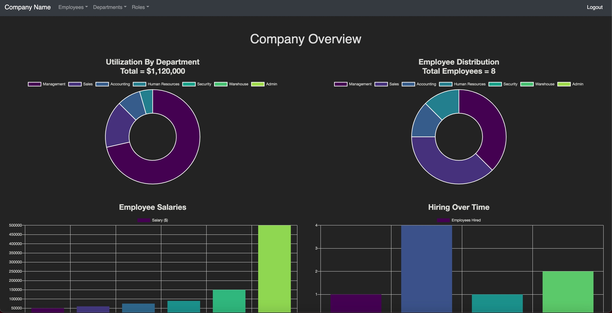
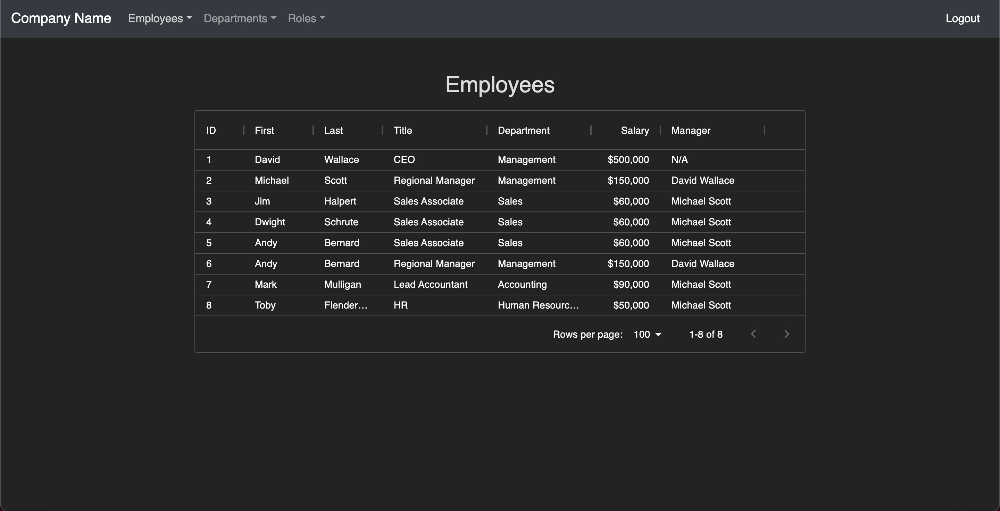
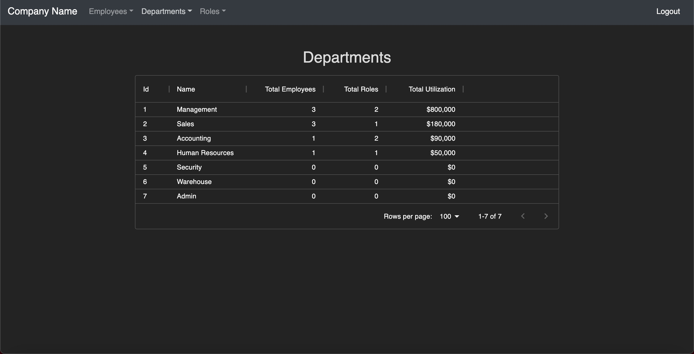
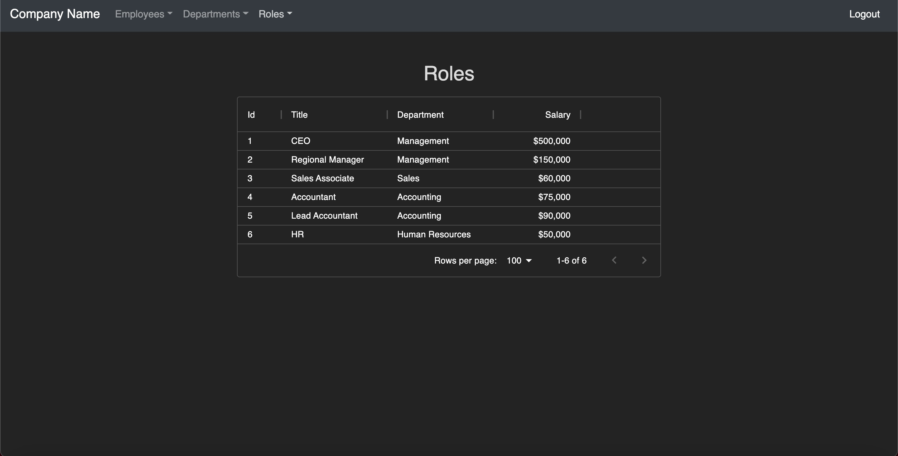

# Employee Management System

## Description 
This app was designed to create a system for the employee data for a compoany.  It includes tables with detailed information about the employees in the companay, roles that exists, and the departments within the compnay.  It also has a data analytics section that displays charts and graph about generally information and trends within the employee data.  

This application is a full stack application that uses mySQL to store the data, an express server built on Node.js on the backend, React.js on the front end and Passport for authentication.  This application also uses React-Chart.js 2 to assist with the data animations.  

### View the Project Live  
https://employee-management-system-1.herokuapp.com/

#### Built With
* React.js
* Node.js
* MySQL
* Passport.js
* Boostrap
* React-Chart.js

## Usage 

#### Dashboard

* Displays analytically data about the company.    

#### Employee Page

* A complete table of all the employees in the company.  

#### Department Page
 
* Displays all the departments in the company.  

#### Roles Page

* Displays all the roles in the company.  

## Questions
[My Github](https://github.com/Mark-Mulligan) || mark.mulligan.jr1@gmail.com

#### How to Contact Me
Feel free to reach out to me if you have any questions about this project.  You can email me using the email listed above or can go to my github page to view my other projects and portfolio.

© Mark Mulligan 2021 All Rights Reserved.